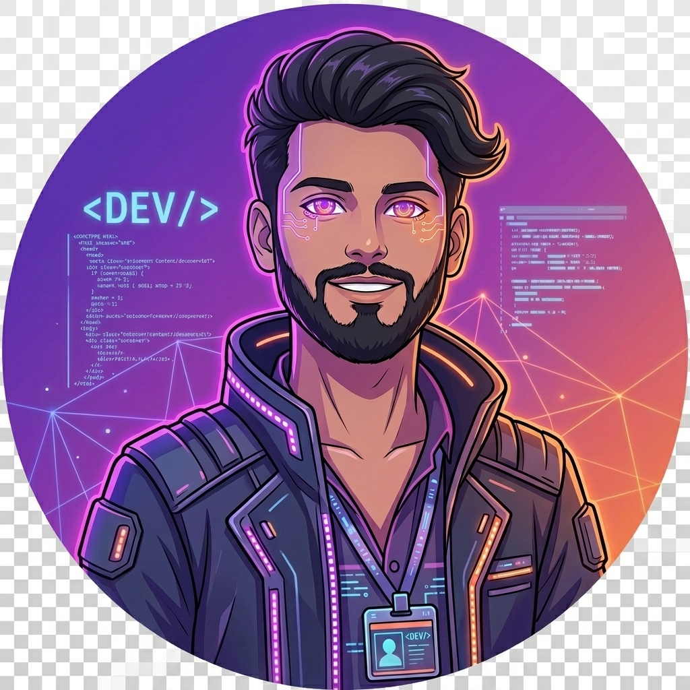

# 🚀 Aman Sah — Personal Portfolio

<div align="center">



**Full Stack & AI Engineer | Kathmandu, Nepal 🇳🇵**

[](https://aman-sah-portfolio.vercel.app)
[](https://github.com/SAman-9814)
[](https://linkedin.com/in/aman-sah9814)
[](mailto:sah99017@gmail.com)

</div>

---

## ✨ Overview

A modern, high-end **personal developer portfolio** built with **React.js + Vite + Tailwind CSS** and advanced web physics. It features gorgeous custom interactive graphics, light/dark themes, an AI-powered chatbot assistant (ARIA), a live GitHub contribution tracker, and a fully functional contact interface.

---

## 🎯 Features & Interactive Animations

| Feature | Description |
|---|---|
| ⏳ **Cybernetic Preloader** | Premium loading screen featuring high-tech dashboard dials, progress rings, and real-time scrambled matrix decryption text. |
| 🌀 **Quantum Particle Core** | A Canvas-based 3D orbiting particle sphere inside the preloader that accelerates and contracts dynamically before exploding outward in a radial "supernova" at 100%. |
| 🌊 **Liquid Wave Page Wipe** | Dual-layered SVG path-morph transition curtain that pulls up elastically on exit, exposing the site content with an organic fluid wave effect. |
| 🕸️ **Gravitational Mesh Grid** | Interactive canvas grid lines that bend locally toward the cursor (magnetic warp) and ripple outwards dynamically when hit by gravitational pulses. |
| ✨ **Header Starfield & Meteor Rain** | Immersive hero background with twinkling star arrays, passing shooting stars (meteors), reactive cursor node connections, and cursor spark trails. |
| 🌙 **Dark / Light Mode** | Fluid theme toggle adjusting layout variables, canvas gradients, and typography colors automatically. |
| 🤖 **ARIA Chatbot** | Smart float-in AI chatbot with custom responsive conversational triggers. |
| 📊 **GitHub Heatmap** | Live contribution tracker matching GitHub's contributions graph in real-time. |
| 📱 **Responsive & Smooth** | Fully responsive layout powered by Framer Motion entrance timings and Lenis smooth scrolling. |

---

## 🛠️ Tech Stack

```
Frontend Core       →  React.js 18, Vite, Tailwind CSS
Animations & Physics →  Framer Motion 12, HTML5 Canvas 2D, SVG Path Morphing
Smooth Scroll       →  Lenis Scroll
Contact Form API    →  Web3Forms API
GitHub Stats        →  GitHub Contributions API + GitHub REST API
Typography & Icons  →  Outfit, Ovo (Google Fonts), Lucide Icons
Deployment          →  Vercel
```

---

## 📂 Project Structure

```
reactjs/
├── public/
│   └── assets/          # Images, AI avatar, icons, resume PDF
├── src/
│   ├── components/
│   │   ├── Preloader.jsx       # Cybernetic dial, 3D particle vortex, text decryptor & liquid curtain
│   │   ├── HeaderBackground.jsx# Canvas starfields, shooting stars, mouse webs & click ripples
│   │   ├── Navbar.jsx          # Desktop & mobile nav + theme toggle
│   │   ├── Header.jsx          # Hero section (integrates HeaderBackground)
│   │   ├── About.jsx           # About info with profile image card
│   │   ├── Skills.jsx          # Interactive skills grid
│   │   ├── Experience.jsx      # Work & education timelines
│   │   ├── Services.jsx        # Cards showing service offerings
│   │   ├── Work.jsx            # Project cards & detail overlays
│   │   ├── GithubStats.jsx     # Live GitHub heatmap calendar
│   │   ├── Contact.jsx         # Web3Forms contact form + status toasts
│   │   ├── Footer.jsx          # Social links footer
│   │   ├── Chatbot.jsx         # Conversational floating assistant (ARIA)
│   │   └── LenisScroll.jsx     # Smooth scrolling wrapper
│   ├── App.jsx                 # AnimationPresence page gate & routing lifecycle
│   ├── main.jsx                # Render mount point
│   └── index.css               # Global tailwind base & keyframe configs
├── index.html                  # SEO head tags + JSON-LD structured data schema
├── tailwind.config.js          # Palette mapping (including darkTheme variables)
└── vite.config.js
```

---

## 🚀 Getting Started

### Prerequisites
- Node.js `v18+`
- npm or yarn

### Installation

```bash
# Clone the repository
git clone https://github.com/SAman-9814/aman-sah-portfolio.git

# Navigate into the project
cd aman-sah-portfolio

# Install dependencies
npm install

# Start development server
npm run dev
```

Open [http://localhost:5173](http://localhost:5173) in your browser.

### Build for Production

```bash
npm run build
```

---

## 🔧 Configuration

### Contact Form (Web3Forms)
1. Get a free API key at [web3forms.com](https://web3forms.com)
2. Replace the `access_key` in `src/components/Contact.jsx`

### Social Links
Update links and information in:
- `src/components/Footer.jsx` — GitHub, LinkedIn, WhatsApp handles
- `src/components/Chatbot.jsx` — ARIA's responsive dialog facts

---

## 🎨 Interactive Physics Settings (Developers)

If you'd like to adjust the visual densities, speeds, or thresholds of the canvas animations:
- **Preloader Particles & Grid**: Tweak values inside `useEffect` in [Preloader.jsx](file:///d:/aman-sah-portfolio-main/aman-sah-portfolio-main/reactjs/src/components/Preloader.jsx) (e.g., `particleCount`, `gridSpacing`, `warpStrength`, `ripples`).
- **Header Particle Density & Speed**: Tweak arrays in [HeaderBackground.jsx](file:///d:/aman-sah-portfolio-main/aman-sah-portfolio-main/reactjs/src/components/HeaderBackground.jsx) (e.g., `starCount`, `meteorSpawnRate`, `friction`, `connectionRadius`).

---

## 📄 License

This project is open source and available under the [MIT License](LICENSE).

---

<div align="center">

**Built with ❤️ by [Aman Sah](https://github.com/SAman-9814)**

⭐ Star this repo if you found it helpful!

</div>
